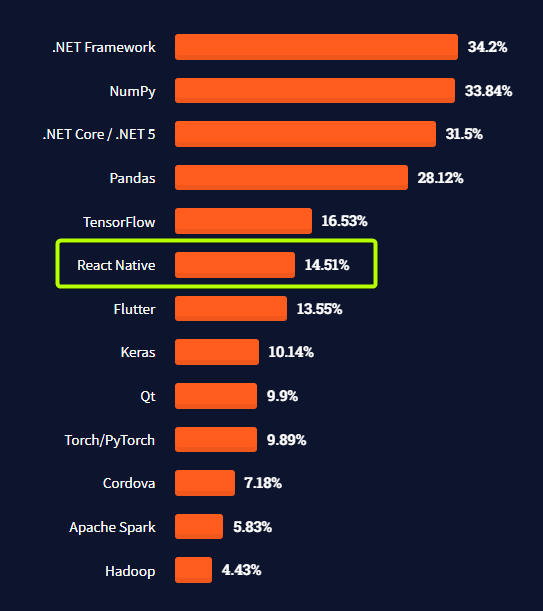

# React Native

React Native est une compétence qui me permet de développer des applications multi-plateformes. Cela signifie que je peux créer une application qui fonctionne à la fois sur iOS et Android en utilisant un seul code source. Cette compétence est particulièrement utile dans un contexte professionnel où il est nécessaire de développer des applications pour différents systèmes d'exploitation.

De nombreuses entreprises utilisent React Native pour développer des applications internes ou pour leurs clients. Par exemple, Facebook utilise React Native pour développer son application, et d'autres entreprises comme Airbnb, Tesla et Uber ont également adopté cette technologie pour leurs propres applications.

J'ai moi-même utilisé React Native pour développer une application de gestion de projet de construction qui regroupe les différentes parties prenantes (artisans, clients et conducteurs de travaux) sur une seule application. Cela a permis de simplifier la communication et la coordination entre les différentes parties prenantes, améliorant ainsi l'efficacité et réduisant les risques de retard ou de dépassement de budget.

Mon niveau de maîtrise de React Native est assez élevé, je suis capable de développer des fonctionnalités avancées et de résoudre les problèmes courants. Cependant, il y a encore une marge de progression, car React Native n'est pas une technologie qui convient à tous les cas d'utilisation.

Cette compétence est importante pour mon profil car elle me permet de développer des applications multi-plateformes efficacement. J'ai acquis cette compétence assez rapidement en me formant en autodidacte, mais je pense qu'il est toujours important de continuer à se perfectionner en suivant des formations et en lisant la documentation.

Actuellement je n'ai pas de formation en cours mais je compte poursuivre mon apprentissage de cette compétence pour être à jour avec les dernières tendances et pour continuer à améliorer mes compétences. En termes de projet professionnel, je souhaite continuer à utiliser React Native pour développer des applications efficaces pour les entreprises et les clients.