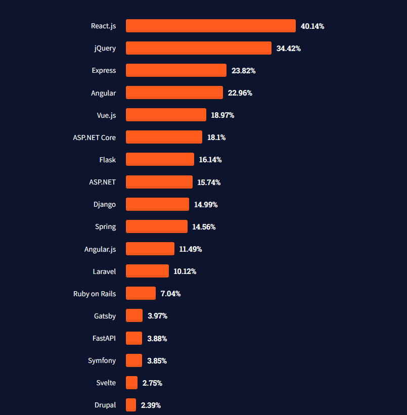

React est une librairie Javascript et Typescript développée par Facebook depuis 2013 qui permet de construire des interfaces utilisateurs sur le web.

La librairie bénéficie d'une large communauté, et les adeptes de React maintiennent de nombreux modules très utiles, les rendant encore plus puissants et fonctionnels.

React permet de simplifier le développement front-end en apportant une vraie touche de modernité à la création d'interfaces. En effet, React permet de créer un DOM virtuel afin de facilement agir sur le contenu de la page web.

Grâce à cette librairie, il est possible de décomposer les pages en plusieurs composants logiques paramétrables et réutilisables. Le langage utilisé pour créer un composant est le JSX, un mélange ingénieux de Javascript et de HTML.

# Mises en œuvre

React est très réputé dans le monde professionnel et est une des solutions les plus utilisées pour créer des interfaces web avec Angular.

# Évolution et autocritique

Avant d'intégrer l'entreprise qui m'a accueilli pour mon alternance, je ne connaissais pas la technologie React. J'ai suivi divers tutoriels afin d'arriver à mon alternance avec quelques cartes en poches. Cependant, le développement par composants était une technique nouvelle et difficile à comprendre pour moi. Il me manquait une chose primordiale pour m'aider à progresser : développer quelque chose de concret afin de me confronter aux problèmes et restrictions en entreprise.
En rejoignant l'équipe de développement de mon entreprise, il m'a fallu un temps d'adaptation pour pouvoir être un minimum autonome sur le développement d'une tâche.
Le lead développeur de l'équipe devait me relire et valider mes développement afin qu'ils soient conformes aux normes de développement du projet.

# Réalisations
